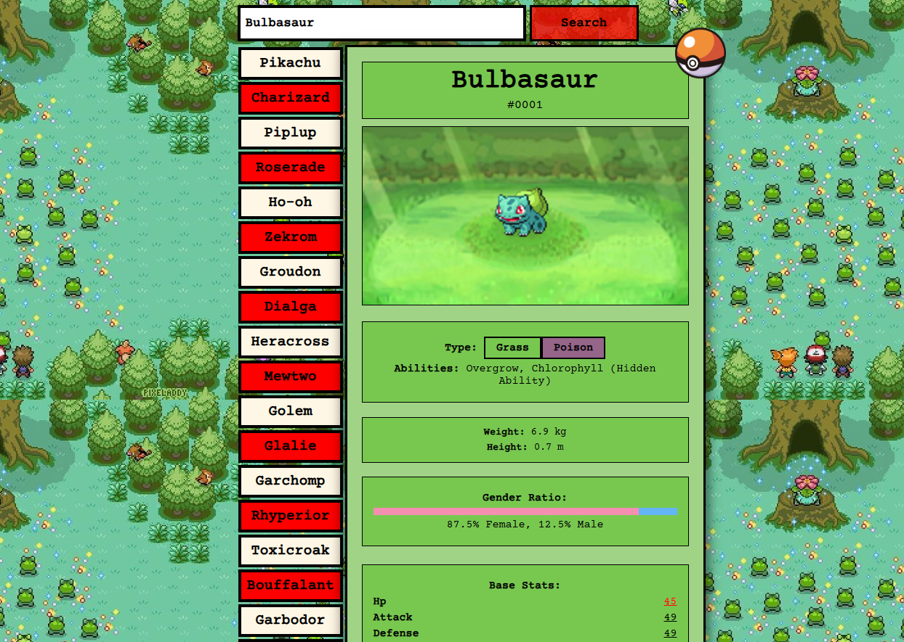

# Universal Pokedex
I hate the new-style pokemon games. They suck. I made a retro pokedex for the oldies. Improved retro pokedex for all pokemon gens 1-5 (Kanto to Unova).
Cool features:
- Type-based wallpapers 
- Custom wallpapers for certain legendaries
- Pokeball hyperlink changes based on pokemons strength. For example, legendaries have masterballs and psuedo-legendaries have luxury balls
- Event based wallpapers for special pokemon (Garchomp, Infernape)

